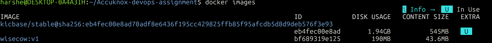
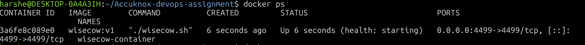
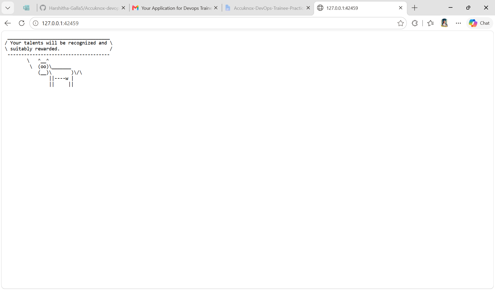
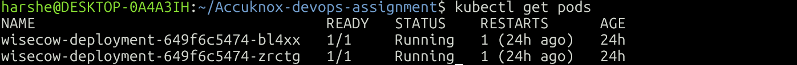
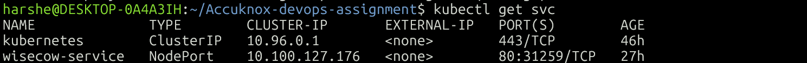
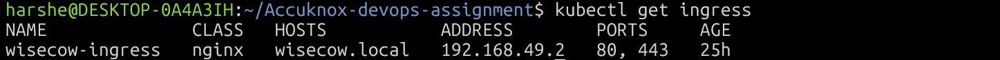
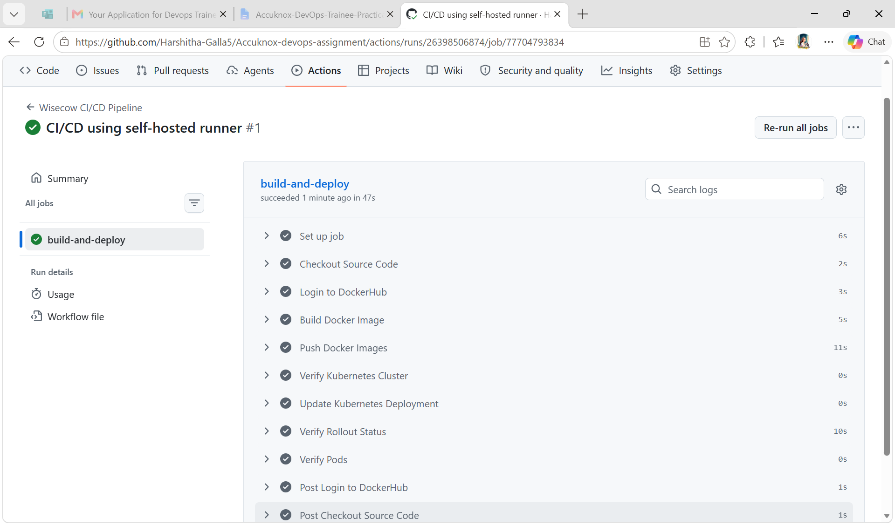
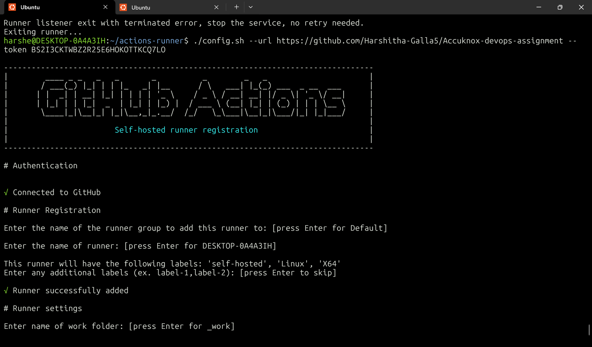
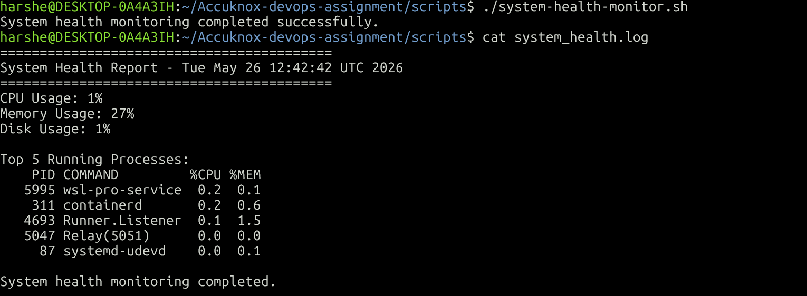
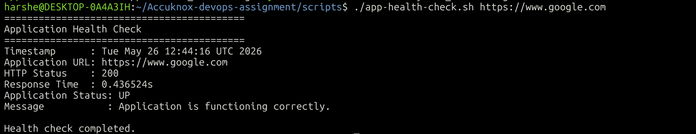

# Accuknox DevOps Trainee Practical Assessment

# Wisecow Application Deployment on Kubernetes with CI/CD, TLS & KubeArmor

---

# Project Overview

This project demonstrates the complete containerization, deployment, automation, monitoring, and runtime security implementation of the Wisecow application using Docker, Kubernetes, GitHub Actions CI/CD, TLS configuration, and KubeArmor zero-trust policies.

The implementation was completed as part of the Accuknox DevOps Trainee Practical Assessment.

---

# Objectives

## Problem Statement 1

* Containerize the Wisecow application using Docker
* Deploy the application on Kubernetes
* Expose the application using Kubernetes Service & Ingress
* Implement TLS secure communication
* Build CI/CD pipeline using GitHub Actions
* Implement Continuous Deployment using self-hosted runners

---

## Problem Statement 2

Implemented two DevOps-focused Bash scripts:

### 1. System Health Monitoring Script

* CPU monitoring
* Memory monitoring
* Disk usage monitoring
* Running process monitoring
* Threshold-based alert logging

### 2. Application Health Checker

* HTTP status monitoring
* Application UP/DOWN detection
* Response time monitoring
* Error handling & logging

---

## Problem Statement 3 (Bonus)

Implemented KubeArmor zero-trust runtime security policies:

* Block shell execution
* Block package manager access
* Block sensitive file access

---

# Technologies Used

| Technology     | Purpose                  |
| -------------- | ------------------------ |
| Docker         | Containerization         |
| Kubernetes     | Container orchestration  |
| Minikube       | Local Kubernetes cluster |
| Ingress NGINX  | Traffic routing          |
| GitHub Actions | CI/CD automation         |
| DockerHub      | Container registry       |
| Bash Scripting | Monitoring automation    |
| KubeArmor      | Runtime security         |
| WSL2 Ubuntu    | Development environment  |

---

# Project Architecture

```text
Developer → GitHub Repository → GitHub Actions CI/CD → DockerHub
                                                             ↓
                                                     Kubernetes Cluster
                                                             ↓
                                                 Wisecow Application Pods
                                                             ↓
                                                  Service → Ingress → TLS
```

---

# Project Structure

```text
Accuknox-devops-assignment/
│
├── app/
├── k8s/
├── kubearmor/
├── scripts/
├── screenshots/
├── .github/workflows/
│
├── Dockerfile
├── README.md
```

---

# Dockerization

## Docker Features Implemented

* Ubuntu-based Docker image
* Installed application dependencies
* Containerized Wisecow application
* Exposed application port
* Health check implementation
* Optimized lightweight image

---

## Build Docker Image

```bash
docker build -t <dockerhub-username>/wisecow:latest .
```

---

## Run Docker Container

```bash
docker run -d -p 4499:4499 --name wisecow-container <dockerhub-username>/wisecow:latest
```

---

# Docker Screenshots

## Docker Images





---

## Running Docker Container





---

## Wisecow Application Running





---
# Kubernetes Deployment

## Kubernetes Resources Created

* Deployment
* Service
* Ingress
* TLS Secret

---

## Apply Kubernetes Manifests

```bash
kubectl apply -f k8s/
```

---

## Verify Kubernetes Resources

```bash
kubectl get pods
kubectl get svc
kubectl get ingress
```

---

# Kubernetes Screenshots

## Kubernetes Pods





---

## Kubernetes Services





---

## Kubernetes Ingress





---

# TLS Implementation

TLS configuration was implemented using Kubernetes TLS secrets and NGINX Ingress Controller.

A self-signed certificate was generated and attached to the Ingress resource for enabling HTTPS-based secure communication within the Kubernetes environment.

Due to local Minikube + WSL2 networking limitations and browser trust restrictions for self-signed certificates, complete browser-level HTTPS validation was partially limited in the local environment.

However, the following components were successfully implemented:

- TLS secret creation
- Ingress TLS configuration
- HTTPS routing configuration
- Self-signed certificate integration

---

## Create TLS Secret

```bash
kubectl create secret tls wisecow-tls \
--cert=tls.crt \
--key=tls.key
```
---

# CI/CD Pipeline

GitHub Actions workflow was implemented for Continuous Integration and Continuous Deployment.

---

# CI/CD Features

* Automatic Docker image build
* Docker image push to DockerHub
* Self-hosted GitHub runner
* Automatic Kubernetes deployment restart

---

## Workflow File

```text
.github/workflows/cicd.yaml
```

---

# CI/CD Workflow Process

1. Developer pushes code to GitHub
2. GitHub Actions workflow triggered
3. Docker image built automatically
4. Image pushed to DockerHub
5. Kubernetes deployment updated automatically

---

# CI/CD Screenshots

## GitHub Actions Workflow Success





---

## Self Hosted Runner





---

# Problem Statement 2 Scripts

# 1. System Health Monitoring Script

## Features

* CPU usage monitoring
* Memory usage monitoring
* Disk usage monitoring
* Running process monitoring
* Threshold alert logging

---

## Script Location

```text
scripts/system-health-monitor.sh
```

---

## Execute Script

```bash
./scripts/system-health-monitor.sh
```

---

# System Monitoring Screenshots

## System Monitor Output





---

# 2. Application Health Checker

## Features

* HTTP status code validation
* Application UP/DOWN detection
* Response time monitoring
* Logging support
* Error handling

---

## Status Codes Handled

| Status Code | Meaning                        |
| ----------- | ------------------------------ |
| 200         | Application healthy            |
| 3xx         | Redirect response              |
| 404         | Page not found                 |
| 500         | Internal server error          |
| 503         | Service unavailable            |
| 000         | Connection timeout/unreachable |

---

## Script Location

```text
scripts/app-health-check.sh
```

---

## Execute Script

```bash
./scripts/app-health-check.sh https://google.com
```

---

# Application Health Checker Screenshots





---

# Problem Statement 3 (Bonus)

# KubeArmor Zero-Trust Runtime Security

The objective was to implement a zero-trust security model by restricting sensitive operations inside application containers.

# KubeArmor Implementation Notes

Successfully completed:

- KubeArmor installation using Helm
- KubeArmor CRD verification
- Runtime security policy creation
- Policy deployment in Kubernetes cluster
- Violation test script implementation
- Relay and runtime component verification

During implementation, runtime enforcement validation was partially limited due to compatibility constraints between WSL2, Minikube, and container runtime security modules required by KubeArmor.

However, KubeArmor components, policies, CRDs, and runtime configurations were successfully deployed and verified within the Kubernetes environment.

The implementation demonstrates understanding of:

- Zero-trust security concepts
- Kubernetes runtime security
- Policy-based container protection
- Runtime attack surface reduction
---

# Security Policies Implemented

## 1. Block Shell Execution

Restricted shell execution:

```text
/bin/sh

---

## 2. Block Package Manager Access

Restricted:

```text
apt
apt-get
```

---

## 3. Block Sensitive File Access

Restricted:

```text
/etc/passwd
/etc/shadow
```

---

# Policy File

```text
kubearmor/wisecow-policy.yaml
```

---

# Apply KubeArmor Policy

```bash
kubectl apply -f kubearmor/wisecow-policy.yaml
```

---

# Test Violation Script

```bash
./test-violations.sh
```
---

# Challenges Faced

* The original Wisecow shell script (`wisecow.sh`) was not responding correctly inside the Docker container due to networking and netcat behavior.

* Container health checks initially failed because the application was not properly serving HTTP responses inside the container.

* Docker container port accessibility issues were encountered while testing the application using localhost and browser access.

* Ingress routing and external accessibility in Minikube were difficult to validate due to WSL2 + Minikube networking limitations.

* HTTPS/TLS testing using self-signed certificates caused browser trust and timeout issues during local environment validation.

* Continuous Deployment setup using self-hosted GitHub runners required additional dependency installation and runner configuration troubleshooting.

* KubeArmor runtime security enforcement was partially limited because of compatibility constraints between WSL2, Minikube, Docker driver, and Linux security modules required by KubeArmor.

* Runtime security policy validation required extensive troubleshooting related to CRDs, runtime components, relay services, and local Kubernetes environment compatibility.
---

# Conclusion

Successfully implemented:

* Docker containerization
* Kubernetes deployment
* CI/CD automation using GitHub Actions
* Self-hosted GitHub runner deployment
* Linux system monitoring scripts
* Application health monitoring

This project demonstrates practical DevOps concepts including:

* Containerization
* Kubernetes orchestration
* CI/CD automation
* Monitoring
* Runtime security
* Infrastructure troubleshooting
